# 📚 Fondamentaux du CSS et de Tailwind CSS

## ✅ 1. Le Box Model : `margin`, `border`, `padding`, `content`

Le Box Model est le cœur du fonctionnement CSS. Chaque élément HTML s’affiche comme une **boîte rectangulaire** composée de :

- `margin` : espace **extérieur** à la boîte (entre les éléments)
- `border` : la **bordure** qui entoure la boîte
- `padding` : espace **intérieur** entre le contenu et la bordure
- `content` : zone où le texte, image ou composant s’affiche

---

### 🧠 Visuel du modèle de boîte

```
+---------------------------+
|        margin             |
|  +--------------------+   |
|  |      border        |   |
|  |  +--------------+  |   |
|  |  |   padding    |  |   |
|  |  |  content     |  |   |
|  |  +--------------+  |   |
|  +--------------------+   |
+---------------------------+
```

---

### 📋 Exemple Tailwind Play

```html
<div class="space-y-6 p-6 bg-white">

  <!-- Boîte A -->
  <div>
    <p class="text-sm text-gray-600 mb-1">Boîte A – <strong>width: 64, sans padding ni border</strong></p>
    <div class="w-64 bg-yellow-300">
      Contenu direct
    </div>
  </div>

  <!-- Boîte B -->
  <div>
    <p class="text-sm text-gray-600 mb-1">Boîte B – <strong>width: 64 + padding</strong></p>
    <div class="w-64 bg-green-300 p-4">
      Contenu avec padding
    </div>
  </div>

  <!-- Boîte C -->
  <div>
    <p class="text-sm text-gray-600 mb-1">Boîte C – <strong>width: 64 + padding + border</strong></p>
    <div class="w-64 bg-blue-300 p-4 border-4 border-blue-700">
      Contenu avec padding + bordure
    </div>
  </div>

  <!-- Boîte D -->
  <div>
    <p class="text-sm text-gray-600 mb-1">Boîte D – <strong>width: 64 + padding + border + margin</strong></p>
    <div class="w-64 bg-pink-300 p-4 border-4 border-pink-600 m-4">
      Contenu avec padding + bordure + marge
    </div>
  </div>
</div>
```

---

📸 **Capture à insérer :**  
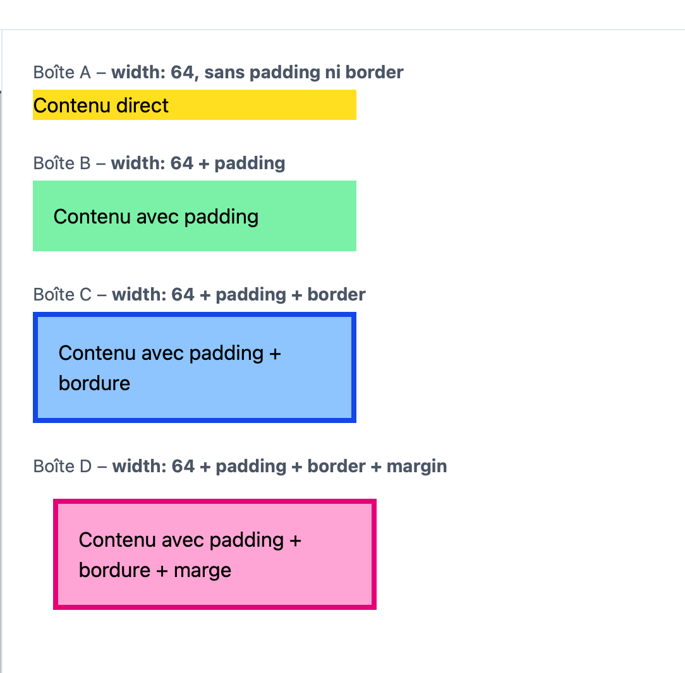

---

### 📐 Ce que ça fait :

- Tu observes l'effet visuel du `padding` (espace interne) et du `border`
- Chaque boîte a une `width` fixe (`w-64`) mais le rendu final change selon ce que l'on **ajoute autour**
- Le `margin` est visible entre les boîtes grâce à `space-y-6`


## ✅ 2. Flexbox horizontal : `justify-*`

Les classes `justify-*` définissent **l’alignement horizontal** des enfants à l’intérieur d’un conteneur `flex`.

---

### 🧠 Principes clés :

| Classe              | Effet                                                                 |
|---------------------|-----------------------------------------------------------------------|
| `justify-start`     | Aligne tous les enfants à gauche (par défaut)                        |
| `justify-center`    | Centre les enfants horizontalement                                   |
| `justify-end`       | Aligne tous les enfants à droite                                     |
| `justify-between`   | Laisse le 1er collé à gauche et le dernier à droite, espace entre    |
| `justify-around`    | Même espace **autour** de chaque élément                             |
| `justify-evenly`    | Répartit l’espace **également** entre tous les éléments              |

---

### 📋 Exemple Tailwind Play

```html
<div class="space-y-6 p-4">

  <!-- justify-start -->
  <div>
    <p class="text-sm text-gray-600 mb-1">justify-start</p>
    <div class="flex justify-start items-center space-x-4 bg-gray-100 p-4 rounded">
      
      <div class="text-green-600">Texte vert</div>
      <div class="text-red-600">Texte rouge</div>
    </div>
  </div>

  <!-- justify-center -->
  <div>
    <p class="text-sm text-gray-600 mb-1">justify-center</p>
    <div class="flex justify-center items-center space-x-4 bg-gray-100 p-4 rounded">
      
      <div class="text-green-600">Texte vert</div>
      <div class="text-red-600">Texte rouge</div>
    </div>
  </div>

  <!-- justify-end -->
  <div>
    <p class="text-sm text-gray-600 mb-1">justify-end</p>
    <div class="flex justify-end items-center space-x-4 bg-gray-100 p-4 rounded">
      
      <div class="text-green-600">Texte vert</div>
      <div class="text-red-600">Texte rouge</div>
    </div>
  </div>

  <!-- justify-between -->
  <div>
    <p class="text-sm text-gray-600 mb-1">justify-between</p>
    <div class="flex justify-between items-center bg-gray-100 p-4 rounded">
      
      <div class="text-green-600">Texte vert</div>
      <div class="text-red-600">Texte rouge</div>
    </div>
  </div>

  <!-- justify-around -->
  <div>
    <p class="text-sm text-gray-600 mb-1">justify-around</p>
    <div class="flex justify-around items-center bg-gray-100 p-4 rounded">
      
      <div class="text-green-600">Texte vert</div>
      <div class="text-red-600">Texte rouge</div>
    </div>
  </div>

  <!-- justify-evenly -->
  <div>
    <p class="text-sm text-gray-600 mb-1">justify-evenly</p>
    <div class="flex justify-evenly items-center bg-gray-100 p-4 rounded">
      
      <div class="text-green-600">Texte vert</div>
      <div class="text-red-600">Texte rouge</div>
    </div>
  </div>

</div>
```

---

📸 **Capture à insérer :**  
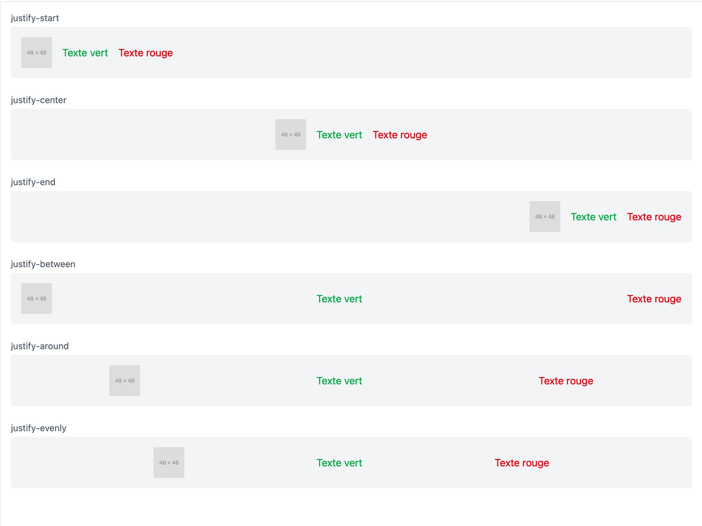

---

### 📐 Ce que ça fait :

- Le **conteneur** utilise `display: flex` avec `flex-direction: row` (par défaut)
- Chaque variation de `justify-*` aligne **horizontalement** les enfants :
  - `start` → aligné à gauche
  - `center` → centré
  - `end` → aligné à droite
  - `between` → bord gauche + bord droit
  - `around` → espace équilibré autour de chaque élément
  - `evenly` → espace strictement égal partout


## ✅ 3. Flexbox vertical : `items-*`

Les classes `items-*` définissent **l’alignement vertical** des enfants dans un conteneur `flex` en `flex-row` (par défaut).

---

### 🧠 Principes clés :

| Classe            | Effet                                                   |
|-------------------|----------------------------------------------------------|
| `items-start`     | Aligne les enfants **en haut** du conteneur             |
| `items-center`    | Centre les enfants **verticalement**                    |
| `items-end`       | Aligne les enfants **en bas**                           |
| `items-stretch`   | Étire les enfants pour qu’ils prennent toute la hauteur |
| `items-baseline`  | Aligne les enfants sur la **ligne de base du texte**    |

---

### 📋 Exemple Tailwind Play

```html
<div class="space-y-6 p-4 h-60">

  <!-- items-start -->
  <div>
    <p class="text-sm text-gray-600 mb-1">items-start</p>
    <div class="flex items-start space-x-4 bg-gray-100 p-4 rounded h-32">
      
      <div class="text-green-600 text-xl">Texte vert</div>
      <div class="text-red-600 text-xs">Texte rouge</div>
    </div>
  </div>

  <!-- items-center -->
  <div>
    <p class="text-sm text-gray-600 mb-1">items-center</p>
    <div class="flex items-center space-x-4 bg-gray-100 p-4 rounded h-32">
      
      <div class="text-green-600 text-xl">Texte vert</div>
      <div class="text-red-600 text-xs">Texte rouge</div>
    </div>
  </div>

  <!-- items-end -->
  <div>
    <p class="text-sm text-gray-600 mb-1">items-end</p>
    <div class="flex items-end space-x-4 bg-gray-100 p-4 rounded h-32">
      
      <div class="text-green-600 text-xl">Texte vert</div>
      <div class="text-red-600 text-xs">Texte rouge</div>
    </div>
  </div>

  <!-- items-stretch -->
  <div>
    <p class="text-sm text-gray-600 mb-1">items-stretch</p>
    <div class="flex items-stretch space-x-4 bg-gray-100 p-4 rounded h-32">
      
      <div class="bg-green-200 w-24">Étiré</div>
      <div class="bg-red-200 w-24">Étiré</div>
    </div>
  </div>

  <!-- items-baseline -->
  <div>
    <p class="text-sm text-gray-600 mb-1">items-baseline</p>
    <div class="flex items-baseline space-x-4 bg-gray-100 p-4 rounded h-32">
      
      <div class="text-green-600 text-4xl">Titre</div>
      <div class="text-red-600 text-xs">sous-titre</div>
    </div>
  </div>

</div>
```

---

📸 **Capture à insérer :**  
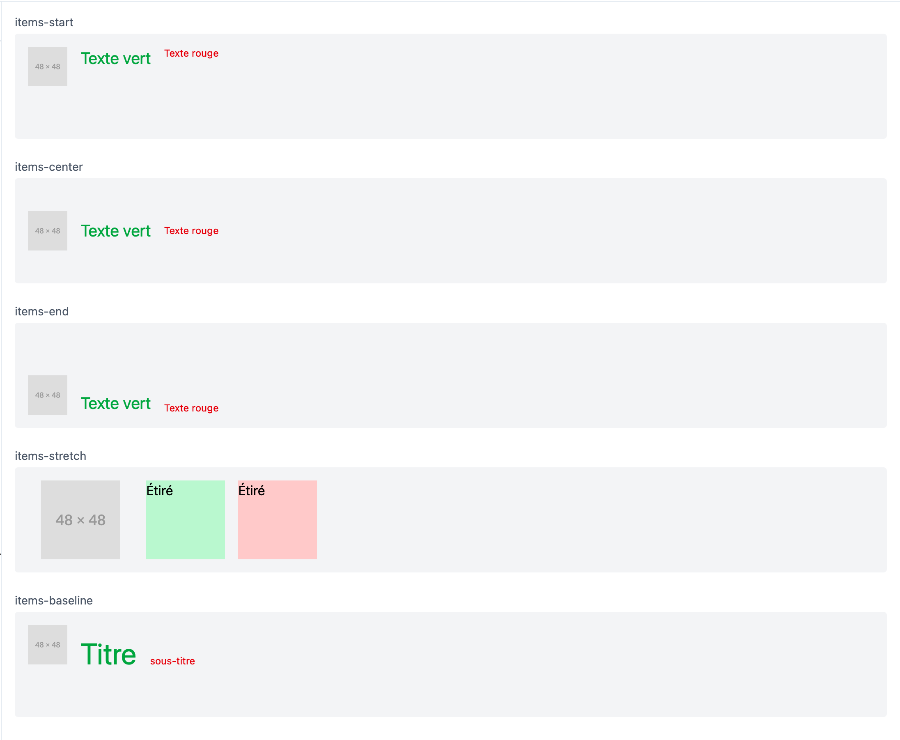

---

### 📐 Ce que ça fait :

- Le conteneur est en `flex-row` avec une hauteur fixe (`h-32`)
- Chaque exemple montre un **alignement vertical** différent des enfants :
  - `items-start` → tous en haut
  - `items-center` → centrés verticalement
  - `items-end` → tous en bas
  - `items-stretch` → les blocs s’étirent pour prendre toute la hauteur
  - `items-baseline` → les textes sont alignés sur leur **ligne de base**


## ✅ 4. Espacement entre les éléments : `space-x-*` et `space-y-*`

Les classes `space-*` permettent d’ajouter un **espace uniforme entre les enfants** d’un conteneur `flex`.

---

### 🧠 Principes clés :

| Classe         | Fonction                                      |
|----------------|-----------------------------------------------|
| `space-x-*`    | Ajoute un **espace horizontal** entre les enfants |
| `space-y-*`    | Ajoute un **espace vertical** entre les enfants   |
| Ne s’applique **pas** au dernier élément |

---

### 📋 Exemple Tailwind Play

```html
<div class="p-4 space-y-8">

  <!-- Ligne avec space-x -->
  <div>
    <p class="text-sm text-gray-600 mb-1">Ligne horizontale avec <code>space-x-4</code></p>
    <div class="flex space-x-4 bg-gray-100 p-4 rounded">
      <div class="bg-blue-300 p-4">Bloc A</div>
      <div class="bg-green-300 p-4">Bloc B</div>
      <div class="bg-red-300 p-4">Bloc C</div>
    </div>
  </div>

  <!-- Colonne avec space-y -->
  <div>
    <p class="text-sm text-gray-600 mb-1">Colonne verticale avec <code>space-y-4</code></p>
    <div class="flex flex-col space-y-4 bg-gray-100 p-4 rounded">
      <div class="bg-blue-300 p-4">Bloc 1</div>
      <div class="bg-green-300 p-4">Bloc 2</div>
      <div class="bg-red-300 p-4">Bloc 3</div>
    </div>
  </div>

</div>
```

---

📸 **Capture à insérer :**  
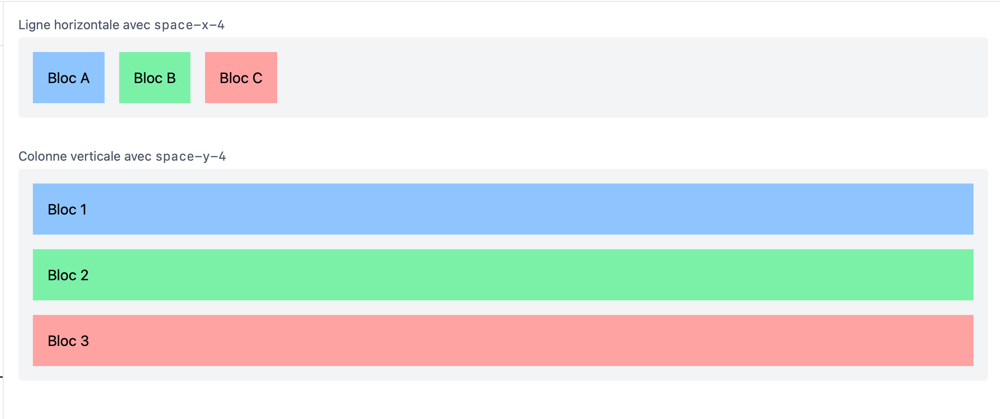

---

### 📐 Ce que ça fait :

- `space-x-4` crée un **espacement horizontal** entre les blocs d’une ligne
- `space-y-4` crée un **espacement vertical** entre les blocs d’une colonne
- Aucun `margin` sur le dernier enfant : c’est propre et régulier
- Tu peux ajuster la valeur (`1`, `2`, `4`, `8`, etc.) pour contrôler l’écart


## ✅ 5. Positionnement : `relative` et `absolute`

Le système de positionnement permet de placer un élément indépendamment du flux normal du document.

---

### 🧠 Concepts clés :

| Classe        | Comportement                                                         |
|---------------|----------------------------------------------------------------------|
| `relative`    | Positionne l’élément **par rapport à lui-même** (sert de repère pour les enfants `absolute`) |
| `absolute`    | Positionne l’élément **par rapport à son parent positionné** (souvent en `relative`)       |
| `top-0`, `left-0`... | Positionne précisément par rapport au coin supérieur gauche (ou autre combinaison) |

---

### 📋 Exemple Tailwind Play :

```html
<div class="relative bg-blue-100 p-8 w-64 h-32 border rounded">
  <p>Boîte parent <code>.relative</code></p>

  <!-- Enfant en position absolue -->
  <div class="absolute top-0 right-0 bg-red-400 text-white text-sm px-2 py-1 rounded-bl">
    Badge
  </div>
</div>
```

---

📸 **Capture à insérer :**  
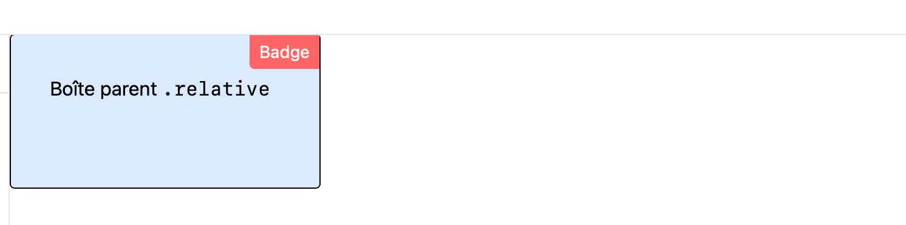

---

### 📐 Ce que ça fait :

- Le conteneur bleu est positionné en `relative` → c’est le **repère**
- L’élément rouge (`.absolute`) se colle **en haut à droite du conteneur bleu**
- Pratique pour ajouter :
  - un **badge de notification**
  - une **icône de fermeture**
  - un **overlay flottant**
  - un **label positionné librement**


## ✅ 6. Espacement avec `gap-*`

`gap` permet de gérer **l’espace entre les éléments** d’un conteneur `flex` ou `grid`, sans avoir à gérer les marges (`space-*` est une alternative plus spécifique à `flex`).

---

### 🧠 Concepts clés :

| Classe       | Effet                                        |
|--------------|-----------------------------------------------|
| `gap-2`      | Espace de `0.5rem` (8px) entre les éléments   |
| `gap-x-4`    | Espace horizontal de 1rem (16px)              |
| `gap-y-4`    | Espace vertical de 1rem (16px)                |
| `gap-0`      | Aucun espace entre les enfants                |

---

### 📋 Exemple Tailwind Play :

```html
<!-- Horizontal -->
<div class="flex gap-4 bg-gray-100 p-4 rounded">
  <div class="bg-blue-300 p-4">Bloc A</div>
  <div class="bg-green-300 p-4">Bloc B</div>
  <div class="bg-red-300 p-4">Bloc C</div>
</div>

<!-- Vertical -->
<div class="flex flex-col gap-4 bg-gray-100 p-4 mt-6 rounded">
  <div class="bg-blue-300 p-4">Bloc 1</div>
  <div class="bg-green-300 p-4">Bloc 2</div>
  <div class="bg-red-300 p-4">Bloc 3</div>
</div>
```

---

📸 **Capture à insérer :**  
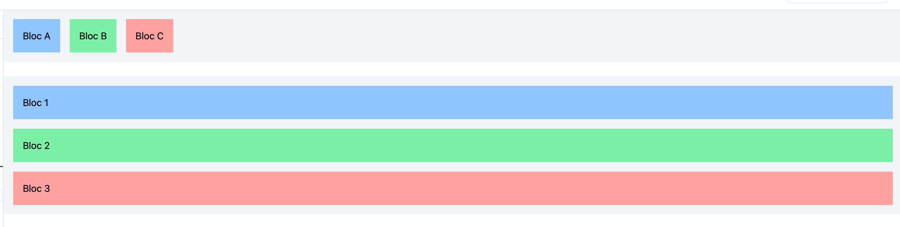

---

### 📐 Ce que ça fait :

- Dans le 1er bloc : `flex` horizontal avec un `gap-4` ➝ 16px entre chaque colonne
- Dans le 2e bloc : `flex-col` vertical avec un `gap-4` ➝ 16px entre chaque ligne
- Le `gap` s’applique **entre** les enfants, sans modifier leurs `margin`
- Très utile en layout `grid`, mais aussi dans `flex` pour plus de lisibilité

## ✅ 7. Différence entre `gap-*` et `space-*`

---

### 🧠 Concepts clés

| Propriété     | Fonctionne avec   | Agit sur         | Applique une marge ? | Direction spécifique |
|---------------|-------------------|------------------|-----------------------|----------------------|
| `gap-*`       | `flex` / `grid`   | le parent        | ❌ Non                | ✅ `gap-x`, `gap-y`  |
| `space-*`     | `flex` uniquement | les enfants      | ✅ Oui (sauf dernier) | ✅ `space-x`, `space-y` |

---

### 📋 Exemples Tailwind Play

```html
<!-- Exemple avec gap -->
<div class="flex gap-4 rounded bg-gray-100 p-4">
  <div class="bg-blue-300 p-4">1</div>
  <div class="bg-green-300 p-4">2</div>
  <div class="bg-red-300 p-4">3</div>
</div>

<!-- Exemple avec space-x -->
<div class="flex space-x-4 bg-gray-100 p-4">
  <div class="bg-blue-300 p-4">1</div>
  <div class="bg-green-300 p-4">2</div>
  <div class="bg-red-300 p-4">3</div>
</div>
```

---

📸 **Capture à insérer :**  
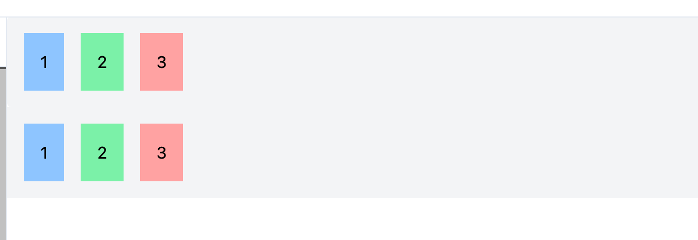

---

### 📐 Ce que ça fait :

- `gap-4` crée un **espace uniforme** entre les enfants, sans marge visible
- `space-x-4` applique une **marge droite** sur chaque enfant (sauf le dernier)
- `space-*` est plus visuel, mais dépend de la structure des enfants
- `gap-*` est plus moderne, et fonctionne aussi en `grid` (pas `space-*`)


## ✅ 8. Design responsive avec `sm:`, `md:`, `lg:`, `xl:`, `2xl:`

Tailwind te permet d’adapter l’affichage de tes composants selon la **taille de l’écran** grâce à des **préfixes**.

---

### 🧠 Principes clés :

| Préfixe | Taille minimale (min-width) | Appareils typiques              |
|---------|------------------------------|----------------------------------|
| `sm:`   | `640px`                      | Petits écrans (mobile paysage)  |
| `md:`   | `768px`                      | Tablettes                       |
| `lg:`   | `1024px`                     | Laptops                         |
| `xl:`   | `1280px`                     | Écrans larges                   |
| `2xl:`  | `1536px`                     | Très grands écrans              |

👉 Un préfixe `md:bg-red-200` signifie : **à partir de 768px de large**, le fond devient rouge clair.

---

### 📋 Exemple Tailwind Play

```html
<div class="p-4 rounded text-center text-white font-bold
  bg-blue-500
  sm:bg-green-500
  md:bg-yellow-500
  lg:bg-red-500
  xl:bg-purple-500
">
  Taille d’écran responsive
</div>
```

---

### 📐 Ce que ça fait :

- Le composant change de **couleur de fond** selon la **largeur du viewport**
- Tu peux appliquer n’importe quelle propriété Tailwind avec un préfixe responsive
- Cela permet de construire des interfaces **adaptatives sans media queries CSS**

---

✅ Exemple concret : passer une `flex-col` (colonne sur mobile) en `flex-row` (ligne sur grand écran) :

```html
<div class="flex flex-col md:flex-row gap-4">
  <div class="bg-blue-200 p-4 rounded w-full">Bloc 1</div>
  <div class="bg-green-200 p-4 rounded w-full">Bloc 2</div>
</div>
```


## ✅ 9. Gérer le dépassement avec `overflow-*`, `truncate`, `text-clip`, `line-clamp`

Lorsque le **contenu dépasse** les dimensions de son conteneur, tu peux choisir comment l’afficher ou le masquer.

---

### 🧠 Classes utiles :

| Classe             | Effet                                                       |
|--------------------|-------------------------------------------------------------|
| `overflow-hidden`  | Masque tout ce qui dépasse (aucun scroll)                   |
| `overflow-auto`    | Ajoute une scrollbar **si besoin**                          |
| `overflow-scroll`  | Affiche toujours une scrollbar                              |
| `truncate`         | Tronque une **ligne unique** avec `...`                     |
| `text-clip`        | Coupe le texte sans `...`                                   |
| `line-clamp-N`     | Limite le texte à **N lignes** avec `...` à la fin          |

> ℹ️ Pour `line-clamp`, assure-toi d’avoir activé le plugin dans `tailwind.config.js`.

---

### 📋 Exemple Tailwind Play

```html
<!-- Boîte overflow -->
<div class="w-64 h-24 overflow-auto bg-gray-100 p-2 border rounded">
  Lorem ipsum dolor sit amet, consectetur adipiscing elit. Suspendisse pulvinar nisi nec velit porta, et hendrerit risus cursus. Vivamus euismod, lorem a accumsan dapibus.
</div>

<!-- Truncate -->
<div class="w-64 truncate bg-yellow-100 p-2 mt-4">
  Ceci est un titre très très long qui sera tronqué…
</div>

<!-- Text clip -->
<div class="w-64 text-clip bg-green-100 p-2 mt-4">
  Ceci est un titre très très long qui sera simplement coupé
</div>

<!-- Line clamp -->
<div class="w-64 line-clamp-2 bg-blue-100 p-2 mt-4">
  Ce texte est long, il pourrait s’étendre sur plusieurs lignes, mais il sera coupé après deux lignes et remplacé par trois petits points.
</div>
```

---

📸 **Capture à insérer :**  
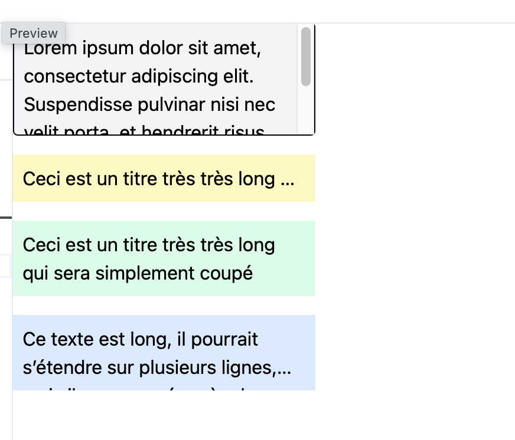

---

### 📐 Ce que ça fait :

- Le 1er bloc affiche une **scrollbar verticale automatique**
- Le 2e tronque une **ligne unique** avec `...`
- Le 3e coupe net le texte à la largeur sans `...`
- Le 4e limite le texte à **2 lignes** avec `...` grâce à `line-clamp-2`

---

🎯 Très utile pour :
- Des aperçus de texte (cartes, listes)
- Des éléments de type "titre d’article", "description", etc.
- Conserver des mises en page propres sans débordement


## ✅ 10. Boutons interactifs avec `hover`, `active`, `focus`, `dark`

Les classes Tailwind permettent de styliser des **comportements interactifs** très facilement, sans écrire de CSS personnalisé.

---

### 🧠 Principes clés :

| Classe Tailwind        | État ciblé                  |
|------------------------|-----------------------------|
| `hover:bg-blue-600`    | Quand l’utilisateur survole |
| `active:bg-blue-700`   | Quand l’utilisateur clique  |
| `focus:ring-2`         | Quand l’élément reçoit le focus clavier |
| `dark:bg-gray-800`     | En mode sombre              |
| `transition` + `duration-300` | Ajoute une animation fluide      |

---

### 📋 Exemple Tailwind Play

```html
<!-- Bouton clair avec interactions -->
<button class="bg-blue-500 text-white px-4 py-2 rounded 
  hover:bg-blue-600 
  active:bg-blue-700 
  focus:outline-none focus:ring-2 focus:ring-blue-300 
  transition duration-300
">
  Bouton clair
</button>

<!-- Bouton foncé pour mode dark -->
<button class="bg-gray-200 text-gray-800 px-4 py-2 rounded 
  hover:bg-gray-300 
  active:bg-gray-400 
  dark:bg-gray-800 dark:text-white 
  dark:hover:bg-gray-700 
  transition duration-300 ml-4
">
  Bouton dark mode
</button>
```

---

📸 **Capture à insérer :**  


---

### 📐 Ce que ça fait :

- Le **1er bouton** change de couleur au survol (`hover`), au clic (`active`) et reçoit un halo bleuté au focus clavier (`focus:ring`)
- Le **2nd bouton** utilise des classes `dark:` pour s’adapter automatiquement au mode sombre
- Grâce à `transition` et `duration-300`, les changements sont **fluides et animés**
- Aucun CSS personnalisé nécessaire !

---

✅ Tu peux également ajouter des **icônes**, ou transformer un `div` ou un `a` en bouton avec `role="button"` si besoin.


## ✅ 11. Organiser les éléments avec `grid`

Le système `grid` permet de créer des **mises en page en colonnes/lignes** très facilement avec Tailwind.  
Tu peux définir le **nombre de colonnes**, l’**écart entre les éléments**, le **placement**, et bien plus.

---

### 🧠 Principes clés :

| Classe Tailwind        | Effet                                      |
|------------------------|--------------------------------------------|
| `grid`                 | Active le mode `display: grid`             |
| `grid-cols-3`          | Définit 3 colonnes                         |
| `gap-4`                | Espace horizontal + vertical entre items   |
| `gap-x-4`, `gap-y-2`   | Espaces distincts en X/Y                   |
| `col-span-2`           | Étend un item sur plusieurs colonnes       |
| `grid-rows-2`          | Définit 2 lignes (peu utilisé en pratique) |

---

### 📋 Exemple Tailwind Play

```html
<div class="grid grid-cols-3 gap-4 p-4 bg-gray-50 rounded">

  <div class="bg-blue-300 p-4 rounded">1</div>
  <div class="bg-green-300 p-4 rounded">2</div>
  <div class="bg-red-300 p-4 rounded">3</div>
  <div class="bg-yellow-300 p-4 rounded">4</div>
  <div class="bg-purple-300 p-4 rounded col-span-2">5 (col-span-2)</div>
  <div class="bg-pink-300 p-4 rounded">6</div>

</div>
```

---

📸 **Capture à insérer :**  
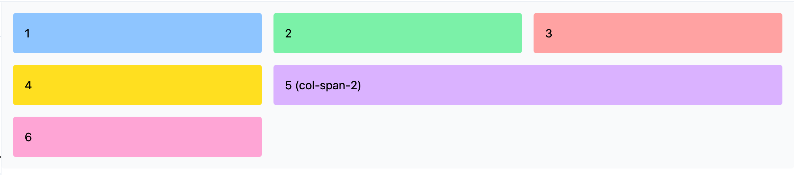

---

### 📐 Ce que ça fait :

- `grid grid-cols-3` crée **3 colonnes** de largeur égale
- `gap-4` ajoute de l’espace régulier entre les cases
- Les éléments 1 à 6 remplissent les lignes dans l’ordre
- L’élément **5** occupe 2 colonnes grâce à `col-span-2`, ce qui casse la grille standard
- Très utile pour créer des galeries, tableaux de bord, cartes responsives…

---

✅ Tu peux aussi utiliser `md:grid-cols-2`, `lg:grid-cols-4` pour créer des grilles **adaptatives selon la taille d’écran**.


## ✅ 12. États UI dynamiques : `disabled`, `loading`, `aria-*`

Pour offrir une bonne expérience utilisateur, les interfaces doivent gérer des **états visuels spécifiques** : désactivé, en chargement, inaccessible, etc.

Tailwind te permet de styliser facilement ces états avec des classes conditionnelles.

---

### 🧠 Principes clés :

| État                  | Classe Tailwind associée                            |
|------------------------|-----------------------------------------------------|
| Désactivé             | `disabled:bg-gray-300`, `disabled:opacity-50`       |
| Focus clavier         | `focus:outline-none`, `focus:ring`                  |
| Chargement (managé via JS) | `aria-disabled="true"` + `cursor-wait` + `opacity-50` |
| Accessibilité         | `aria-*`, `role="status"`, etc.                     |

---

### 📋 Exemple Tailwind Play

```html
<div class="space-y-4 p-4">

  <!-- Bouton actif -->
  <button class="bg-blue-500 text-white px-4 py-2 rounded 
    hover:bg-blue-600 transition">
    Bouton actif
  </button>

  <!-- Bouton désactivé avec style -->
  <button class="bg-blue-500 text-white px-4 py-2 rounded 
    opacity-50 cursor-not-allowed"
    disabled>
    Bouton désactivé
  </button>

  <!-- Faux bouton loading -->
  <button class="bg-green-500 text-white px-4 py-2 rounded flex items-center gap-2 
    opacity-50 cursor-wait"
    aria-disabled="true">
    <svg class="animate-spin h-4 w-4 text-white" xmlns="http://www.w3.org/2000/svg" fill="none"
         viewBox="0 0 24 24" stroke="currentColor">
      <circle class="opacity-25" cx="12" cy="12" r="10" stroke-width="4"></circle>
      <path class="opacity-75" fill="currentColor" d="M4 12a8 8 0 018-8v4l3-3-3-3v4a8 8 0 00-8 8z"/>
    </svg>
    Chargement…
  </button>

</div>
```

---

📸 **Capture à insérer :**  
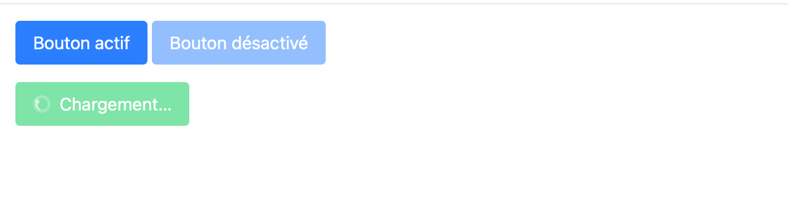

---

### 📐 Ce que ça fait :

- Le **1er bouton** est normal avec un effet `hover`
- Le **2e bouton** est **vraiment désactivé** (avec l’attribut `disabled`) et stylisé (`opacity-50`, `cursor-not-allowed`)
- Le **3e bouton** simule un état de **chargement**, utile lors d’un appel API :
  - Il utilise une icône SVG qui tourne (`animate-spin`)
  - L’état est géré par `aria-disabled="true"` pour l’accessibilité
  - Le curseur change (`cursor-wait`) et l’opacité est réduite

---

✅ Astuce :
Tu peux aussi conditionner ces classes dans React avec :
```tsx
<button className={isLoading ? "opacity-50 cursor-wait" : ""}>Envoyer</button>
```


## ✅ 13. Créer des cartes (cards) avec image, titre, contenu

Les **cartes** sont des composants visuels très utilisés pour présenter de l’information de manière compacte et esthétique.

---

### 🧠 Principes clés :

Une carte typique comprend :
- Une **image** en haut ou à gauche
- Un **titre** lisible
- Une **description** ou un sous-titre
- Des **actions** (lien, bouton, icône)

---

### 📋 Exemple Tailwind Play

```html
<div class="max-w-sm rounded-xl border shadow-sm overflow-hidden bg-white dark:bg-gray-900 dark:text-white">

  <!-- Image -->
  

  <!-- Contenu -->
  <div class="p-4 space-y-2">
    <h2 class="text-xl font-semibold">Tomate 'Cœur de Bœuf'</h2>
    <p class="text-sm text-gray-600 dark:text-gray-300">
      Grosse tomate charnue, idéale pour les salades d'été.
    </p>
    <div class="flex justify-between items-center pt-2">
      <span class="text-xs text-gray-500">Disponible en juin</span>
      <button class="text-sm text-blue-600 hover:underline">Voir fiche</button>
    </div>
  </div>

</div>
```

---

📸 **Capture à insérer :**  
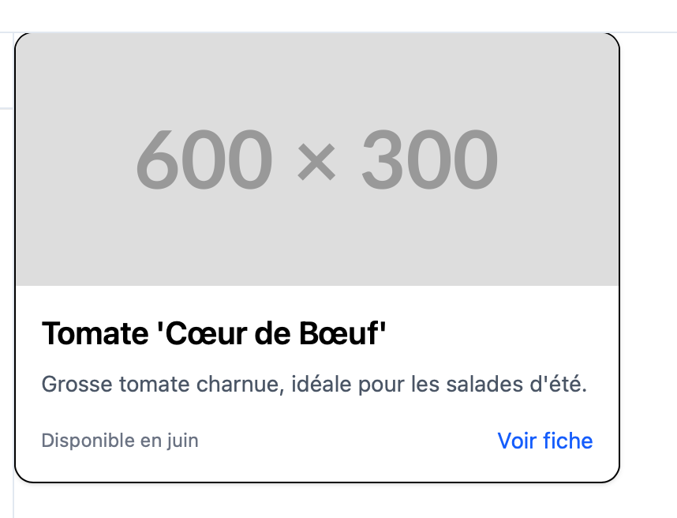

---

### 📐 Ce que ça fait :

- La **structure visuelle** est soignée : coins arrondis, ombre légère, image large
- Le texte est bien espacé avec `space-y-2`, et le bouton `hover:underline` donne du feedback
- Compatible avec **le mode sombre** grâce aux classes `dark:*`
- La carte s’adapte naturellement aux tailles d’écran (`max-w-sm`)

---

✅ Tu peux en faire une **grille de cartes** avec `grid grid-cols-2`, ou ajouter une **icône d’action** dans le coin.